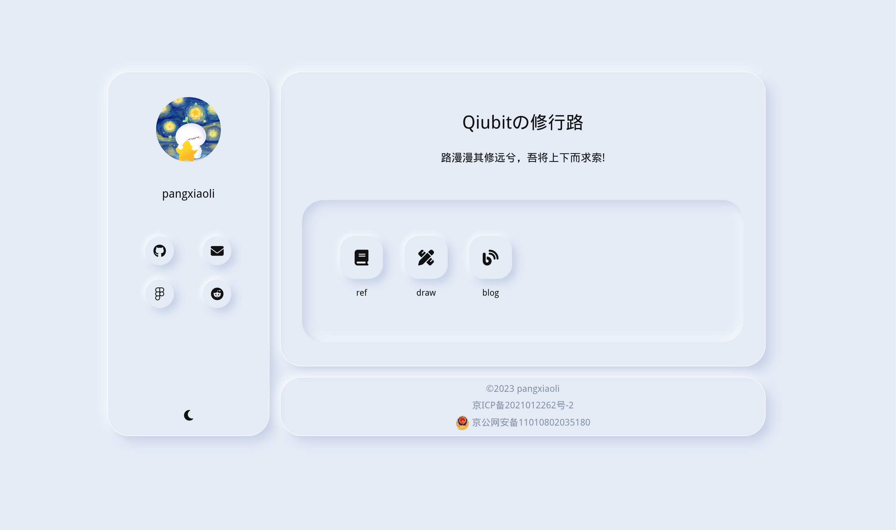
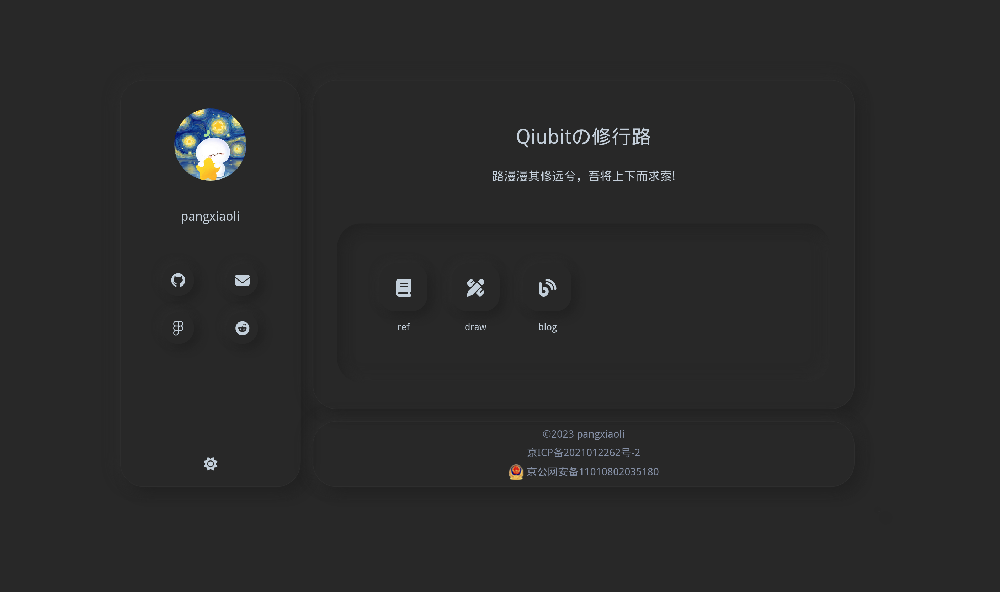
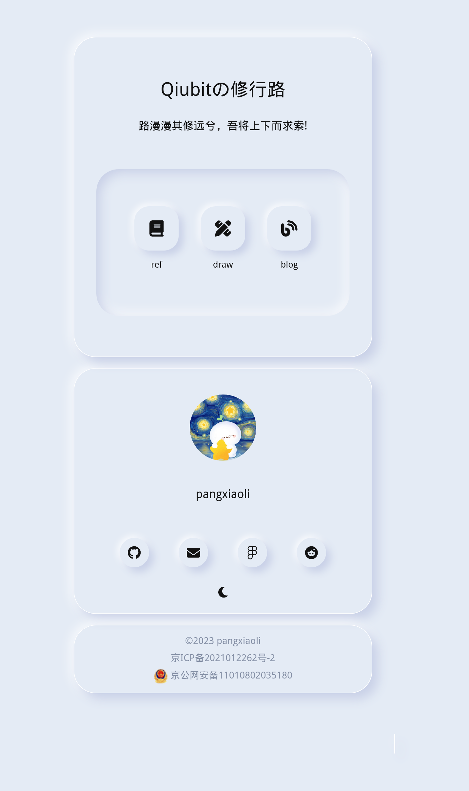

# homepage

一个 soft UI 的 home 页.

## 🌿 特性
- 🌠 支持暗黑模式
- ☎️  响应式设计、移动端适配
- 🖥️ 私有部署、二次开发
- 🎁 多组件可替换 (TODO)
- 📌 Ts + React 支持完整的类型提示

## 🗺️ 截图




## 开始
```
yarn
yarn dev
yarn build
```

## 📦 私有部署
### 🌐 github pages
支持 github workflow 自动发版，注册并为 actions 添加秘钥，命名为`ACCESS_TOKEN`即可。

master 分支的 pull 或者 pr 触发 action ,自动构建到 gh-pages 分支(需可写);

### 🔎 nginx or other http server

### 🐬 docker （TODO）

